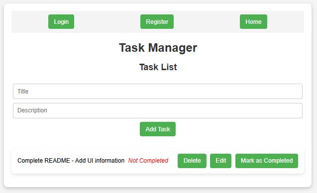

# Task Management API

A simple Task Management System with a focus on backend development. 

## Introduction
This project is a backend API for managing tasks. It is built using Node.js and Express, with MongoDB as the database. The API provides endpoints for creating, reading, updating, and deleting tasks. Asynchronous processing is implemented using RabbitMQ. Jest is used for unit testing. The API is containerized using Docker and Docker Compose. The frontend is built using React.

## Installation
### Prerequisites
- [Node.js](https://nodejs.org/) (version 18 or higher)
- [npm](https://www.npmjs.com/)
- [Docker](https://www.docker.com/)
- [Docker Compose](https://docs.docker.com/compose/)
- [MongoDB](https://www.mongodb.com/)
- [RabbitMQ](https://www.rabbitmq.com/)

### Steps
1. Clone the repository:
   ```sh
   git clone https://github.com/nickbarrie/Task-Management-API.git
    ```
2. Install dependencies:
    ```sh
    npm install
    ```
3. Change directory to the project folder (if needed):
    ```sh
    cd Task-Managment-API
    ```
4. Create a `.env` file in the root of the project and add the following environment variables (replace values as needed):
    ```
    PORT=5000
    MONGO_URI=mongodb://mongo:27017/task-manager-api
    RABBITMQ_URI=amqp://rabbitmq:5672
    NODE_ENV=run
    SECRET_KEY=mySuperSecretKey123
    ```
5. Start the application:
    ``` 
    docker-compose up --build
    ```


## Usage

The API will be available at `http://localhost:5000`  
The frontend is available at `http://localhost:3000`


The API provides the following endpoints:

- Create a new task
    - **URL**: `/tasks`
    - **Method**: `POST`
    - **Request Body**:
        ```json
        {
        "title": "Task 1",
        "description": "Description of Task 1",
        "completed": false
        }
        ```
    - **Authorization**:
        ```json
            {
            "Authorization": "Bearer YOUR_JWT_TOKEN"
            }   

         ```

    - **Response Body**:
        ```json
        {
            "message": "Task creation request sent to queue"
        }
        ```

- Get all tasks
    - **URL**: `/tasks`
    - **Method**: `GET`

    - **Authorization**:
        ```json
            {
            "Authorization": "Bearer YOUR_JWT_TOKEN"
            }

         ```
    - **Response Body**:
        ```json
        [
            {
                "_id": "67c20e79db52f1e3a4ef0636",
                "title": "Task 1",
                "description": "Description of Task 1",
                "completed": false,
                "createdAt": "2022-01-31T14:00:00.000Z",
                "updatedAt": "2022-01-31T14:00:00.000Z",
                "__v": 0
            },
            {
                "_id": "67c340abdb52f1e3a4ef063a",
                "title": "Task 2",
                "description": "Description of Task 2",
                "completed": true,
                "createdAt": "2022-01-31T14:00:00.000Z",
                "updatedAt": "2022-01-31T14:00:00.000Z",
                "__v": 0
            }
        ]
        ```

- Get a task by ID
    - **URL**: `/tasks/:id`
    - **Method**: `GET`
    - **Authorization**:
        ```json
            {
            "Authorization": "Bearer YOUR_JWT_TOKEN"
            }

         ```
    - **Response Body**:
        ```json
        {
            "_id": "67c20e79db52f1e3a4ef0636",
            "title": "Task 1",
            "description": "Description of Task 1",
            "completed": false,
            "createdAt": "2022-01-31T14:00:00.000Z",
            "updatedAt": "2022-01-31T14:00:00.000Z",
            "__v": 0
        }
        ```

- Update a task by ID
    - **URL**: `/tasks/:id`
    - **Method**: `PUT`
    - **Request Body**:
        ```json
        {
            "title": "Task 1",
            "description": "Description of Task 1",
            "completed": true
        }
        ```
    - **Authorization**:
        ```json
            {
            "Authorization": "Bearer YOUR_JWT_TOKEN"
            }

         ```
    - **Response Body**:
        ```json
        {
            "message": "Task update request sent to queue"
        }
        ```
- Delete a task by ID
    - **URL**: `/tasks/:id`
    - **Method**: `DELETE`
    - **Authorization**:
        ```json
            {
         "Authorization": "Bearer YOUR_JWT_TOKEN"
            }

         ```
    - **Response Body**:
        ```json
        {
            "message": "Task deletion request sent to queue"
        }
        ```
## Testing

To run the tests, use the following command:
```sh
    npx jest
```

## Frontend

A simple frontend application is available at `http://localhost:3000`. The frontend is built using React and provides a basic interface for interacting with the API.

To start the frontend, run the following command:
```sh
    cd task-manager-frontend
    npm start
```


## Authentication

The API uses JWT for authentication. To access the API, you need to include a valid JWT token in the `Authorization` header of the request. The token is generated using the `SECRET_KEY` environment variable specified in the `.env` file.

Authentication endpoints:

- Register a new user
    - **URL**: `/users`
    - **Method**: `POST`
    - **Request Body**:
        ```json
            {
            "email": "tim@gmail.com",
            "password": "123"
            }
        ```
    - **Response Body**:
        ```json
           {
            "message":"User registered successfully"
            }
        ```

- Login
    - **URL**: `/users/login`
    - **Method**: `POST`
    - **Request Body**:
        ```json
             {
            "email": "tim@gmail.com",
            "password": "123"
            }
        ```
    - **Response Body**:
        ```json
            {
            "token": "YOUR_JWT_TOKEN"
            }

        ```

## UI Example



